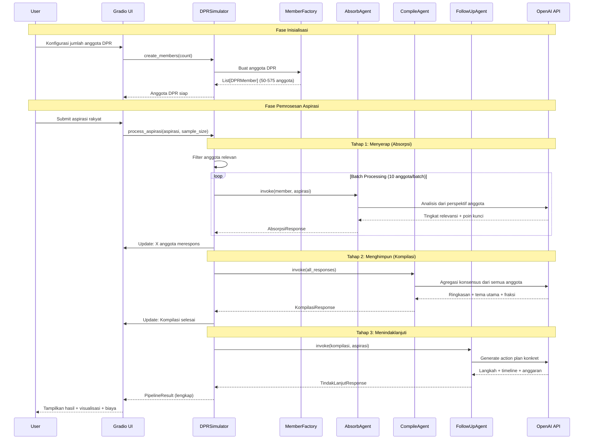

# 🏛️ DPR Simulator

**Simulasi berbasis AI untuk proses Dewan Perwakilan Rakyat (DPR) Indonesia**

Proyek eksperimen untuk mensimulasikan fungsi DPR menggunakan AI agents, menunjukkan potensi efisiensi dibandingkan dengan sistem konvensional yang menghabiskan triliunan rupiah APBN setiap tahunnya.

## 🎯 Tujuan Proyek

Proyek ini mensimulasikan 3 fungsi utama DPR dalam menangani aspirasi rakyat melalui pipeline AI multi-tahap:

1. **Menyerap (Absorb)** - AI agents menyerap dan memahami aspirasi dari perspek
2. if berbagai anggota DPR dengan latar belakang, fraksi, dan daerah pemilihan yang berbeda
3. **Menghimpun (Compile)** - Mengagregasi dan mengkompilasi tanggapan dari banyak anggota menjadi konsensus kolektif
4. **Menindaklanjuti (Follow-up)** - Menentukan langkah konkret tindak lanjut, termasuk komisi penanggung jawab, timeline, dan estimasi anggaran

## ✨ Fitur Utama

- **Interface Gradio Interaktif** - Web UI modern untuk input aspirasi dan visualisasi hasil pemrosesan
- **Simulasi Multi-Agent** - Setiap anggota DPR disimulasikan sebagai AI agent independen dengan karakteristik unik
- **Pemrosesan Paralel dengan Batching** - Efisien memproses puluhan hingga ratusan agent secara bersamaan
- **Pelacakan Biaya Real-time** - Monitoring biaya API OpenAI untuk setiap tahap pemrosesan
- **Visualisasi Data Komprehensif** - Tabel interaktif menampilkan anggota DPR, relevansi, dan tanggapan
- **Konfigurasi Fleksibel** - Pengaturan model, jumlah anggota, dan parameter lainnya melalui environment variables

## 🚀 Instalasi dan Penggunaan

### Prasyarat

- Python 3.12 atau lebih tinggi
- [uv](https://github.com/astral-sh/uv) - Python package manager (direkomendasikan)
- OpenAI API key

### Langkah Instalasi

```bash
# Clone repository
git clone https://github.com/yourusername/dpr-simulator.git
cd dpr-simulator

# Install dependencies menggunakan uv
uv sync
```

> **Catatan:** Aplikasi ini tidak menggunakan file `.env`. API key OpenAI dimasukkan langsung melalui interface Gradio saat menjalankan aplikasi untuk keamanan.

### Menjalankan Aplikasi

```bash
# Jalankan dengan uv
uv run python main.py

# Atau aktifkan virtual environment terlebih dahulu
.venv\Scripts\activate   # Windows
source .venv/bin/activate  # Linux/Mac

# Kemudian jalankan
python main.py
```

Aplikasi Gradio akan tersedia di `http://127.0.0.1:7860`

## 📁 Struktur Proyek

```
dpr-simulator/
├── src/
│   ├── __init__.py
│   ├── config/
│   │   ├── __init__.py
│   │   └── settings.py          # Manajemen konfigurasi aplikasi
│   ├── models/
│   │   ├── __init__.py
│   │   ├── dpr_member.py        # Model data anggota DPR
│   │   ├── aspirasi.py          # Model data aspirasi rakyat
│   │   └── responses.py         # Model respons untuk setiap tahap pipeline
│   ├── core/
│   │   ├── __init__.py
│   │   ├── simulator.py         # Orchestrator utama simulator
│   │   ├── member_factory.py    # Factory untuk membuat anggota DPR
│   │   └── agents/
│   │       ├── __init__.py
│   │       ├── base.py          # Base class untuk semua agent
│   │       ├── absorb_agent.py  # Agent tahap 1: Menyerap
│   │       ├── compile_agent.py # Agent tahap 2: Menghimpun
│   │       └── followup_agent.py # Agent tahap 3: Menindaklanjuti
│   └── ui/
│       ├── __init__.py
│       └── app.py               # Gradio web interface
├── main.py                      # Entry point aplikasi
├── pyproject.toml               # Konfigurasi proyek dan dependencies
└── README.md
```

## ⚙️ Konfigurasi

**API Key:** Dimasukkan langsung melalui interface Gradio (tidak menggunakan file `.env`)

**Pengaturan Lainnya:** Dapat dikonfigurasi melalui environment variables (opsional):

| Variable                   | Default          | Deskripsi                             |
| -------------------------- | ---------------- | ------------------------------------- |
| `OPENAI_MODEL`           | `gpt-4.1-nano` | Model OpenAI yang digunakan           |
| `PROMPT_COST_PER_1K`     | `0.0001`       | Biaya per 1k prompt tokens (USD)      |
| `COMPLETION_COST_PER_1K` | `0.0004`       | Biaya per 1k completion tokens (USD)  |
| `DEFAULT_MEMBER_COUNT`   | `50`           | Jumlah default anggota DPR            |
| `BATCH_SIZE`             | `10`           | Ukuran batch untuk pemrosesan paralel |
| `RATE_LIMIT_DELAY`       | `1.0`          | Delay antar batch (detik)             |
| `GRADIO_SERVER_NAME`     | `127.0.0.1`    | Host server Gradio                    |
| `GRADIO_SERVER_PORT`     | `7860`         | Port server Gradio                    |
| `GRADIO_SHARE`           | `False`        | Share aplikasi secara publik          |

## 💰 Estimasi Biaya

Menggunakan model `gpt-4.1-nano`:

- **Per aspirasi** (20 anggota): ~$0.001-0.005 USD (Rp 15-75)
- **Simulasi penuh** (50 anggota): ~$0.01-0.02 USD (Rp 150-300)
- **Simulasi skala DPR** (575 anggota): ~$0.05-0.10 USD (Rp 750-1500)

Bandingkan dengan anggaran DPR aktual: **~Rp 5 Triliun/tahun**!

## 🔧 Tech Stack

- **LangChain** (v1.2.7+) - Framework orkestrasi LLM
- **LangChain OpenAI** (v1.1.7+) - Integrasi OpenAI dengan LangChain
- **OpenAI** (v2.16.0+) - Provider model bahasa
- **Gradio** (v6.4.0+) - Framework UI web modern untuk Python
- **Pydantic** (v2.12.5+) - Validasi data dan settings management
- **uv** - Python package manager yang cepat

## 📝 Contoh Penggunaan Programmatic

Selain menggunakan Gradio UI, Anda juga dapat menggunakan simulator secara programmatic:

```python
import asyncio
from src.core import DPRSimulator
from src.models import Aspirasi
from datetime import datetime

async def main():
    # Inisialisasi simulator
    simulator = DPRSimulator(api_key="sk-your-api-key")

    # Buat anggota DPR (50 anggota dengan berbagai fraksi dan daerah)
    simulator.create_members(50)

    # Buat aspirasi rakyat
    aspirasi = Aspirasi(
        id=1,
        source="Jawa Barat",
        category="Pendidikan",
        content="Penambahan dana BOS untuk sekolah terpencil di daerah pegunungan",
        priority="Tinggi",
        timestamp=datetime.now(),
    )

    # Proses melalui pipeline lengkap
    result = await simulator.process_aspirasi(
        aspirasi,
        sample_size=20  # Gunakan 20 anggota yang paling relevan
    )

    # Tampilkan hasil
    print(result.summary())
    print(f"\nTotal biaya pemrosesan: ${result.total_cost_usd:.6f}")
    print(f"Anggota yang merespons: {result.simulation_details.anggota_merespons}")
    print(f"Komisi penanggung jawab: {result.tindak_lanjut.komisi_penanggung_jawab}")
    print(f"Timeline: {result.tindak_lanjut.timeline}")

asyncio.run(main())
```

## 🏗️ Arsitektur Pipeline



**Alur Pemrosesan:**

### 1. Tahap Absorpsi (Menyerap)

- Setiap anggota DPR (AI agent) menganalisis aspirasi dari perspektif mereka
- Sistem memfilter anggota yang relevan berdasarkan keahlian dan daerah pemilihan
- Pemrosesan paralel dalam batch (default: 10 anggota per batch)
- Menentukan tingkat relevansi: Tinggi/Sedang/Rendah
- Mengidentifikasi poin-poin kunci dan memberikan rekomendasi awal
- **Output:** `AbsorpsiResponse` untuk setiap anggota (relevansi, alasan, poin kunci, rekomendasi)

### 2. Tahap Kompilasi (Menghimpun)

- Mengagregasi semua tanggapan anggota menjadi satu konsensus
- Mengidentifikasi tema utama yang muncul dari berbagai perspektif
- Mencatat fraksi-fraksi politik yang terlibat
- Menghitung statistik partisipasi (jumlah anggota, distribusi relevansi)
- **Output:** `KompilasiResponse` dengan ringkasan kolektif dan rekomendasi tindak lanjut

### 3. Tahap Tindak Lanjut (Menindaklanjuti)

- Menentukan langkah-langkah konkret tindak lanjut berdasarkan kompilasi
- Menetapkan komisi DPR yang bertanggung jawab
- Membuat timeline realistis untuk implementasi
- Menentukan mekanisme (RDP/Hearing/Kunjungan Kerja/dll)
- Mengestimasi anggaran dengan rincian per item dan sumber dana
- Menetapkan indikator keberhasilan yang terukur
- **Output:** `TindakLanjutResponse` dengan action plan lengkap dan terstruktur

## 🤝 Kontribusi

Kontribusi sangat diterima! Silakan submit Pull Request atau buka Issue untuk diskusi fitur baru.

## 📄 Lisensi

MIT License - bebas digunakan untuk keperluan riset dan edukasi.

---
